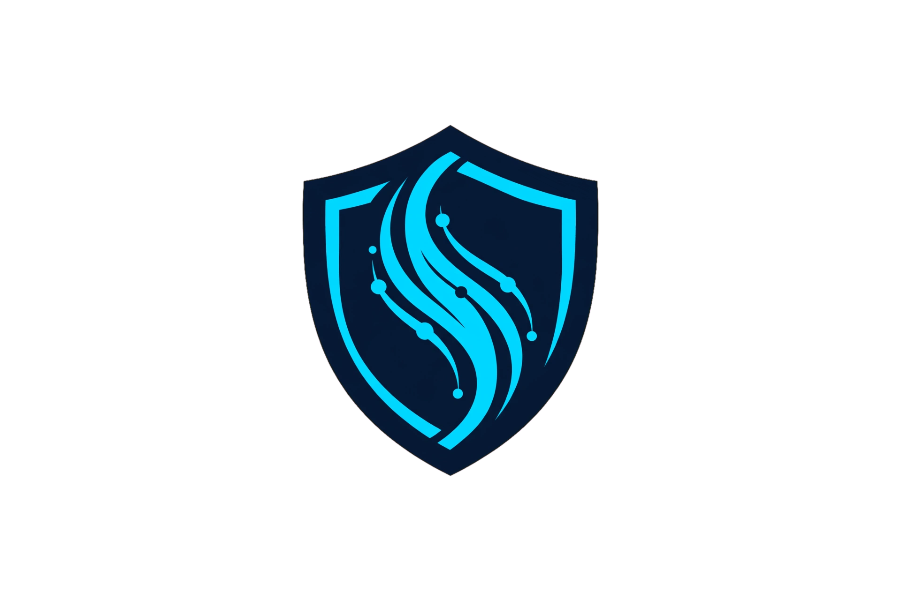

<div align="center">



</div>

# SentinelFlow

<div align="center">

**Production-oriented AI Gateway, intelligent router, policy engine and control plane for multi-provider LLM infrastructure.**

[](https://go.dev/)
[](LICENSE)
[](https://github.com/lecodev-26/sentinelflow/actions/workflows/ci.yml)
[](https://github.com/lecodev-26/sentinelflow/issues)
[](https://github.com/lecodev-26/sentinelflow/stargazers)

</div>

SentinelFlow is an **OpenAI-compatible AI gateway / LLM gateway** for teams running multiple model providers. It combines model routing, provider failover, policy enforcement, AI FinOps, security and observability in one open-source control layer.

SentinelFlow sits between applications and AI providers and turns a collection of model APIs into a governed, observable and cost-aware platform.

It provides one gateway for authentication, tenant isolation, policy enforcement, routing, provider failover, usage accounting, security controls, events, audit and operations.

> **Project status:** V5.0.1 is the latest published stable release. V6 is active development on the separate `v6` branch; `main` remains the stable release line. Production deployment still requires environment-specific PostgreSQL/Redis, provider credentials, identity configuration and operational verification. See [production readiness](docs/v5/ga/production-readiness.md).

## V5.0.1

> SentinelFlow V5 is the current GA release. It adds intelligent request understanding, adaptive routing, agent runtime, tools, memory/RAG, AI security, evaluation and governance. See [V5 architecture](docs/v5/ARCHITECTURE.md), [V5 roadmap](docs/v5/ROADMAP.md) and [V5 GA](docs/v5/ga/GA.md).

## What can you build with it?

- **LLM gateway:** expose one stable API while changing providers behind it.
- **AI model router:** select models using capability, cost, latency, region and policy constraints.
- **Multi-provider failover:** keep requests resilient when an eligible provider becomes unavailable.
- **AI FinOps platform:** track token usage and cost, enforce budgets and make routing cost-aware.
- **Enterprise AI control plane:** manage organizations, projects, environments, policies, identity and audit.
- **LLM security layer:** inspect requests for PII, secrets, prompt-security signals and anomalous traffic.
- **AI observability:** measure provider latency, availability, traces, events and error budgets.

## Why SentinelFlow?

Teams integrating multiple LLM providers usually end up rebuilding the same control layer:

- provider failover and health management
- model selection and routing policies
- API-key, tenant and project isolation
- rate limits, budgets and cost accounting
- PII, secret and prompt-security controls
- audit trails and asynchronous events
- observability and SLOs
- enterprise identity and provisioning

SentinelFlow puts those concerns behind a single API and keeps the decision path explainable.

## Architecture

SentinelFlow is organized into five planes:

| Plane | Responsibility |
|---|---|
| **Control Plane** | Identity, tenancy, RBAC/ABAC, policies, models, providers, budgets, secrets and administration |
| **Data Plane** | Gateway, authentication, authorization, quota, policy, security, cache, routing and execution |
| **Event Plane** | Usage, audit, security, billing and asynchronous event processing |
| **Provider Plane** | OpenAI, Anthropic, local/self-hosted and additional provider adapters |
| **Observability Plane** | Metrics, traces, logs, SLOs, error budgets and operational analytics |

A typical request follows:

`Client → Request ID → Auth → Tenant/Project → Authorization → Quota/Rate limit → Policy/Security → Idempotency/Cache → Routing → Provider → Fallback → Streaming → Usage/Events → Trace → Response`

See [architecture.md](docs/architecture.md) and the [V5 architecture notes](docs/v5/ga/GA.md).

## Core capabilities

- **Multi-provider routing:** provider/model eligibility, cost, latency, capacity, health, region and residency constraints.
- **Failover:** provider failures can move execution to another eligible provider.
- **Policy engine:** authentication/authorization, model and provider restrictions, security and budget controls.
- **Policy lifecycle:** draft → validate → simulate → publish/canary → rollback.
- **FinOps:** token/cost accounting, budgets, forecasting and cost-aware routing primitives.
- **Security Center:** PII and secret detection, prompt-security controls and anomaly detection.
- **Enterprise:** organizations, business units, environments, RBAC/ABAC, SAML 2.0, SCIM groups and approvals.
- **Distributed runtime:** Redis-backed coordination, idempotency/rate limiting and transactional outbox/event processing.
- **Observability:** Prometheus metrics, tracing hooks, provider SLOs and error budgets.
- **Streaming:** normalized streaming execution with TTFT/throughput/duration measurements.
- **Developer experience:** developer portal/playground plus Go and Python SDKs.
- **Deployment:** Docker Compose, Kubernetes/Helm and Terraform foundations.
- **Disaster recovery:** PostgreSQL backup/restore tooling and resilience/chaos tests.

## Quick start

### Requirements

- Go 1.27+
- PostgreSQL 15+ (17 recommended for the V5 Compose stack)
- Redis 7+
- Provider credentials for the providers you enable
- Docker/Compose for the local multi-service stack

### Build and test

```bash
git clone https://github.com/lecodev-26/sentinelflow.git
cd sentinelflow

go test ./...
go build ./cmd/gateway ./cmd/controlplane ./cmd/worker ./cmd/cli ./cmd/migrator
```

### Configuration

Copy the example environment file and provide your own values:

```bash
cp .env.example .env
```

Never commit `.env` or real provider credentials.

SentinelFlow V5.0.1 does **not** use the removed legacy `rules.yaml` configuration. Runtime policy belongs in the control plane/database, while production secrets should come from an external secret manager or the configured secret store.

### Docker Compose

```bash
docker compose -f deploy/v5/docker-compose.yml up --build
```

The V5 Compose stack provides Gateway, Control Plane, Worker, PostgreSQL and Redis. It is a development/reference deployment, not a turnkey production environment.

### Migrations

Migrations are explicit. Use the migrator rather than relying on application startup to mutate production schemas:

```bash
go run ./cmd/migrator status
go run ./cmd/migrator up
```

## API

The gateway exposes OpenAI-compatible endpoints where implemented, including:

- `POST /v1/chat/completions`
- `POST /v1/responses`
- `POST /v1/embeddings`
- `GET /v1/models`

Additional control-plane, audit, analytics, security, regions, webhooks, SAML and SCIM endpoints are documented in [API reference](docs/api.md).

For deployment and operations, see:

- [Quickstart](docs/quickstart.md)
- [Deployment](docs/deployment.md)
- [Operations](docs/operations.md)
- [Production readiness](docs/v5/ga/production-readiness.md)

## SDKs

Go and Python clients live under `sdk/`.

```text
sdk/
├── go/
└── python/
```

See [SDK documentation](sdk/README.md). The public Go module is available as `github.com/lecodev-26/sentinelflow/sdk/go@v0.1.1`.

## Repository map

```text
sentinelflow/
├── cmd/                 # gateway, controlplane, worker, cli, migrator
├── internal/            # domain and runtime packages
├── migrations/          # database migrations
├── deploy/v5/            # Docker Compose, Helm and Terraform
├── sdk/                 # Go and Python clients
├── tests/               # integration/load/e2e tests
├── docs/                # architecture, API, operations and ADRs
└── .github/             # CI and community health files
```

## Development workflow

```bash
# Fast validation
go test ./...

# Formatting and static checks
gofmt -w .
go vet ./...

# Build production commands
go build ./cmd/gateway ./cmd/controlplane ./cmd/worker ./cmd/cli ./cmd/migrator

# Validate the working tree
git diff --check
```

Pull requests should include tests for behavioral changes and documentation for public API/configuration changes.

## Security

Please do not report vulnerabilities in public issues.

Read [SECURITY.md](SECURITY.md) for responsible disclosure instructions.

The repository also includes CI checks for dependency verification, filesystem vulnerability scanning, SBOM generation and release signing.

## Roadmap

- **V3:** enterprise, routing, FinOps, security, developer experience and resilience foundations.
- **V4:** enterprise gateway/control-plane foundation.
- **V5:** intelligent AI execution platform and current GA release.

See [CHANGELOG.md](CHANGELOG.md) for project history and [V5 GA](docs/v5/ga/GA.md) for the current architecture milestone.

## Contributing

Contributions are welcome. Start with [CONTRIBUTING.md](CONTRIBUTING.md), read the [Code of Conduct](CODE_OF_CONDUCT.md), and open an issue before large architectural changes.

## License

SentinelFlow is released under the [MIT License](LICENSE).

---

<div align="center">

If SentinelFlow is useful to you, consider starring the repository and sharing what you build with it.

</div>
